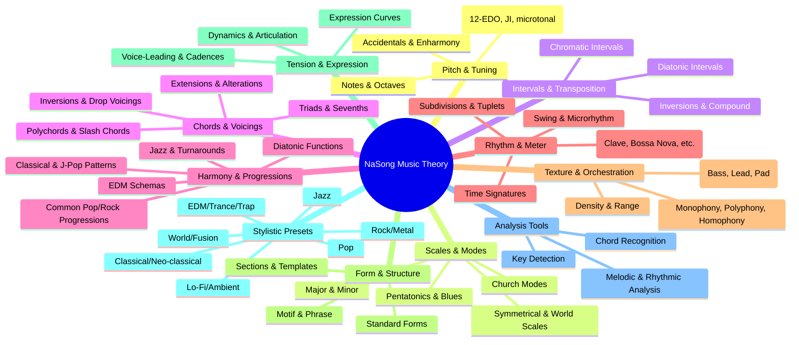

# Music Theory Research

## Prompt 1

Can you do a full research and report on music theory concepts that are relevant to the NaSong project?
I want to have the maximum of helpful functions to help the users to create very various songs, I will have a very well organized access to all of these features so even if I will have thousands of functions it will not be an issue, but a strength.

I want to have a complete overview of all the music theory concepts. I really want that each user from each music style can create very easily and without much additionnal code from their side.


## Answer 1 to prompt 1

This report outlines a comprehensive music theory framework designed for the **NaSong** project. By translating abstract musical concepts into modular Python functions and `Value` objects, you can empower users to "compile" complex compositions across any genre.

---

### 1. Pitch and Scale Systems (The Tonal Foundation)

At its core, NaSong operates on frequencies. To bridge the gap between "code" and "music," users need functions that map standard musical notation to the `Value` signals required by oscillators.

* **Pitch-to-Frequency Mapping**: Implement a `Note` helper that converts standard names (e.g., `"A4"`, `"C#5"`) into frequency constants using the standard  formula.
* **Scale Generators**: Create functions that return lists or generators of frequencies for:
* **Diatonic Modes**: Major (Ionian), Natural Minor (Aeolian), Dorian, Phrygian, Lydian, Mixolydian, and Locrian.
* **Exotic & Specialized Scales**: Pentatonic (major/minor), Blues, Whole Tone, Chromatic, and Melodic/Harmonic Minor.


* **Microtonality & Temperament**: Since NaSong is frequency-based, you can offer alternatives to Equal Temperament, such as Just Intonation or Pythagorean tuning, allowing for non-Western or experimental "out-of-tune" aesthetics.

---

### 2. Harmonic Frameworks (Chords and Progressions)

Harmony involves the simultaneous relationship of pitches. In NaSong, these can be implemented as functions that return a sum of `Value` oscillators.

* **Chord Construction**:
* **Triads**: Major, Minor, Diminished, Augmented.
* **Extended Chords**: 7ths, 9ths, 11ths, and 13ths (crucial for Jazz and Soul styles).
* **Inversions & Voicings**: Functions to "rotate" chords (e.g., moving the root up an octave) and "Slash Chords" (e.g., ).


* **Progression Engines**:
* **Roman Numeral Analysis**: Allow users to define progressions like `["I", "IV", "V", "I"]` in a specific key.
* **Functional Substitutions**: Helpers for "Modal Interchange" (borrowing chords from parallel scales) or "Secondary Dominants" to add professional tension and release.


---

### 3. Temporal Structures (Rhythm, Meter, and Groove)

Rhythm is the "central organizing structure" that orders patterns in time.

* **Meter & Time Signatures**:
* **Simple & Compound**: Support common (4/4, 3/4) and compound (6/8, 9/8) meters.
* **Asymmetrical/Mixed**: Tools for odd meters like 5/4 or 7/8, common in Progressive Rock and Balkan music.


* **Rhythmic Humanization**:
* **Quantization**: A function to snap time-values to a grid.
* **Swing/Groove**: A `Value` modifier that slightly offsets "off-beats" to create a "triplet feel" or "drunk" J Dilla-style groove.
* **Polyrhythms & Syncopation**: Logic to overlay different rhythmic cycles (e.g., 3 against 4).


---

### 4. Formal Architectures (The "Skeleton" of a Song)

To move beyond simple loops, users need tools to structure phrases into full songs.

* **Phrase Logic**: Implement the "Sentence" and "Period" archetypes—structures consisting of an antecedent (question) and a consequent (answer).
* **Standard Forms**:
* **Binary (AB)** and **Ternary (ABA)**.
* **Pop Structure**: Intro, Verse, Chorus, Bridge, Outro.


* **Generative Movement**:
* **Sequences**: Taking a melodic motif and repeating it at different pitch levels.
* **Fragmentation**: Breaking a phrase into smaller, more frantic pieces toward a climax.


---

### 5. Algorithmic & Stylistic Toolkits

This is where NaSong's "Code as Music" philosophy shines.

| Feature | Description | Relevant Style |
| --- | --- | --- |
| **Markov Chains** | Probability-based note selection based on previous notes. | Ambient, Generative |
| **Eulerian Paths** | Graph-based melody generation that visits every "motif" once. | Academic, Experimental |
| **Counterpoint** | Rules for managing multiple independent melodic lines. | Classical, Baroque |
| **Pitch-Class Sets** | Mathematical sets of pitches for non-tonal organization. | Avant-Garde, Modernism |

---

### Suggested Next Steps for Implementation

Would you like me to **draft the Python class structure** for a `Scale` or `Chord` helper that integrates directly with your existing `Value` system?

## Answer 2 to Prompt 1

I’ve created a **full, system-level research document** in the canvas that maps *all major music theory concepts* directly onto NaSong’s philosophy and architecture.

This is not a “theory lesson.”
It’s a **feature blueprint**: every concept is framed as something that can become a **callable function, signal, or transformation**.

A few important things to highlight about what you now have:

* It covers **all musical dimensions**, not just pitch & harmony: time, timbre, form, expression, tuning, culture.
* It treats **genres as parameter bundles**, not hardcoded modes — perfect for NaSong’s modularity.
* It is deliberately **non-Western and non-tonal friendly**.
* Every section implicitly answers: *“What functions should exist so the user doesn’t need extra code?”*
* It aligns extremely well with your `Value` abstraction: theory concepts become **metadata + signals**, not rules.

Think of this document as:

> a **map of the entire musical possibility space**, with signposts for future APIs.

### Suggested next steps (if you want to go deeper)

We can now:

1. Convert this into a **NaSong Theory Module API spec** (function names, arguments, defaults).
2. Design a **3-layer abstraction system** (Musical → Mathematical → Value graph).
3. Create **style packs** (Jazz, EDM, Film, Experimental) built purely from theory presets.
4. Define a **“no-theory user path”** where theory exists but never needs to be named.
5. Map each concept to **training-friendly parameters** for your differentiable instruments.

If you want, tell me which direction you want next:

* API design
* User experience layers
* Genre coverage audit
* Advanced / experimental theory
* Or a brutal “what most music systems forget” analysis

We’re building a **musical operating system** here — and this is its kernel.

### NaSong – Comprehensive Music Theory Concepts Map

> “Music theory is not a set of rules. It is a vocabulary.”
> “Code is not the opposite of art; it is one of its most precise dialects.”

This document is a **complete, system‑oriented survey of music theory concepts**, reorganized specifically for **NaSong’s philosophy**: *everything is a signal, everything is composable, everything is addressable by code*.

The goal is **maximum expressive coverage**:

* Every musical style (Western, non‑Western, tonal, modal, atonal, electronic, experimental)
* Every compositional mindset (songwriter, producer, sound designer, algorithmic composer)
* Minimal user friction: *theory becomes callable functions, not hidden rules*

This is **not pedagogy**. This is **infrastructure**.

---

### 0. Meta‑Principle: Music as Orthogonal Dimensions

All music can be decomposed into **independent but interacting axes**:

1. **Pitch** – vertical organization
2. **Time** – horizontal organization
3. **Timbre** – spectral identity
4. **Dynamics** – energy & contrast
5. **Form** – large‑scale structure
6. **Expression** – deviations from grids
7. **Context** – tuning, culture, expectation

NaSong’s strength is that **each axis can be modeled independently and recombined freely**.

---

### 1. Pitch Theory (Frequency Space)

#### 1.1 Raw Frequency

> “A note is not a letter. It is a ratio.”

**Core concepts**:

* Frequency (Hz)
* Harmonic series
* Overtones / partials
* Inharmonic spectra

**Functions to expose**:

* `hz(f)`
* `ratio(n, d)`
* `harmonic(n, base)`
* `inharmonicity(amount)`

---

#### 1.2 Tuning Systems

> “Equal temperament is a convenience, not a truth.”

**Tuning families**:

* Equal temperament (12‑TET, 19‑TET, 31‑TET…)
* Just intonation
* Meantone
* Pythagorean
* Microtonal / arbitrary
* Scala‑style tuning tables

**NaSong‑friendly abstractions**:

* `Tuning`
* `scale_degree → frequency`
* `pitch_class → ratio`

**Critical feature**:

* Tunings must be **hot‑swappable** without changing composition code

---

#### 1.3 Pitch Representation Layers

Different users think in different abstractions:

* Frequency (Hz)
* MIDI note numbers
* Note names (C#4)
* Scale degrees (♭3, #11)
* Ratios (5/4)

**All must coexist**.

> “The system adapts to the musician, not the opposite.”

---

### 2. Scales & Modal Systems

#### 2.1 Scalar Structures

**Western**:

* Major / Minor
* Harmonic / Melodic minor
* Church modes

**Global & modern**:

* Pentatonic (anhemitonic, hemitonic)
* Blues scales
* Bebop scales
* Symmetric scales (whole‑tone, octatonic)
* Messiaen modes

**Non‑Western**:

* Maqam
* Raga
* Slendro / Pelog

**Functions**:

* `Scale(intervals)`
* `mode(rotation)`
* `degree(n)`

---

#### 2.2 Scale Behavior

Scales are not static lists; they have **behavior**:

* Avoid notes
* Tension notes
* Resolution gravity
* Characteristic tones

**Expose as metadata**:

* `scale.tension_map`
* `scale.resting_degrees`

---

### 3. Harmony (Vertical Time)

> “Harmony is rhythm slowed down.”

#### 3.1 Intervals

* Simple vs compound
* Consonance vs dissonance
* Cultural dependency

**Functions**:

* `interval(semitones | ratio)`
* `invert(interval)`

---

#### 3.2 Chord Construction

**Chord families**:

* Triads
* Seventh chords
* Extended chords (9, 11, 13)
* Altered chords
* Quartal / quintal harmony
* Cluster chords
* Polychords

**Abstractions**:

* `Chord(root, quality, extensions)`
* `voicing(strategy)`

---

#### 3.3 Voice Leading

> “Good harmony is not vertical. It is horizontal politeness.”

**Concepts**:

* Smooth motion
* Contrary motion
* Common tones
* Avoided parallels

**Algorithmic hooks**:

* `minimize_motion()`
* `preserve_common_tones()`

---

### 4. Tonality & Atonality

#### 4.1 Tonal Gravity

* Tonic
* Dominant
* Subdominant
* Functional harmony

**Expose**:

* `Key(center, scale)`
* `gravity_map`

---

#### 4.2 Modal & Post‑Tonal Systems

* Modal harmony
* Planing
* Pitch‑class sets
* Serialism
* Free atonality

**NaSong advantage**:

* No assumption of tonality
* Everything is optional

---

### 5. Rhythm & Time

> “Pitch lives in space. Rhythm lives in expectation.”

#### 5.1 Pulse & Meter

* BPM
* Time signatures
* Additive meters
* Irrational meters

**Functions**:

* `Tempo(bpm)`
* `Meter(n, d)`

---

#### 5.2 Subdivision & Groove

* Straight
* Swing
* Shuffle
* Tuplets
* Microtiming

**Critical NaSong feature**:

* Time ≠ grid

Expose:

* `swing(amount)`
* `humanize(time, velocity)`

---

#### 5.3 Polyrhythm & Polymeter

* Cross‑rhythms
* Phase shifting
* Euclidean rhythms

**Algorithmic power**:

* `euclidean(k, n)`
* `phase(offset)`

---

### 6. Form & Structure

> “A song is a journey with memory.”

#### 6.1 Formal Archetypes

* Binary / ternary
* Verse–chorus
* Sonata
* Through‑composed
* Loop‑based

Expose as:

* `Section(name, duration)`
* `Arrangement(graph)`

---

#### 6.2 Development Techniques

* Repetition
* Variation
* Inversion
* Augmentation / diminution
* Fragmentation

All should be **callable transformations**.

---

### 7. Dynamics & Articulation

#### 7.1 Dynamics

* Velocity
* Accents
* Crescendo / decrescendo

#### 7.2 Articulation

* Legato
* Staccato
* Tenuto
* Marcato

In NaSong:

* These are **control signals**, not annotations

---

### 8. Timbre & Spectral Theory

> “Timbre is harmony unfolding at the speed of light.”

#### 8.1 Harmonic Content

* Brightness
* Spectral centroid
* Odd/even partial balance

#### 8.2 Envelopes

* ADSR
* Multi‑segment
* Nonlinear curves

#### 8.3 Modulation

* AM / FM
* PM
* Waveshaping

NaSong already shines here; theory support should **label and contextualize** these tools musically.

---

### 9. Expressive Deviations

> “Perfect timing sounds dead.”

* Rubato
* Pitch bends
* Vibrato
* Articulation noise

Expose:

* `expression_layer`

---

### 10. Genre‑Specific Constraints as Presets

Genres are **parameter bundles**, not hard rules:

* Jazz → swing + extensions + voice‑leading bias
* EDM → grid‑locked rhythm + sidechain envelopes
* Classical → dynamic shaping + form
* Experimental → disabled assumptions

---

### 11. Algorithmic & Generative Theory

> “A rule that can be broken by code can be explored infinitely.”

* Markov harmony
* Probabilistic rhythm
* Constraint‑based composition
* Cellular automata
* Fractals

These are **first‑class citizens** in NaSong.

---

### 12. The Ultimate NaSong Design Rule

> “Every concept must exist in three layers.”

1. **Musical meaning**
2. **Mathematical representation**
3. **Composable API**

If a concept cannot be composed, transformed, or modulated, it is not finished.

---

### Closing

NaSong does not need to *teach* music theory.

It needs to **embody it**.

When every theoretical idea becomes a callable, combinable, inspectable object, users stop asking:

> “How do I write this style?”

And start saying:

> “What happens if I bend the rules… just a little?”

That is where music lives.

## Answer 3 to Prompt 1

### **NaSong Music Theory Integration Framework: A Comprehensive Research Report**

This report provides a strategic framework for integrating a comprehensive range of music theory concepts into the NaSong project. The goal is to empower users to create diverse, stylistically rich music through intuitive, high-level functions, transforming the system from a synthesizer into a true "Code as Music" composition environment.

### **1. Foundational Philosophy and Conceptual Framework**

NaSong's core philosophy, "Code as Music," aligns with the view that composition can be an algorithmic, iterative process of "hard work". Your project is uniquely positioned to bridge the gap between abstract music theory and concrete audio synthesis. The key is to build a hierarchical library where low-level signal `Value` objects are the atoms, and high-level music theory functions are the molecules and structures built from them.

The proposed framework is based on three pillars:
1.  **Canonical Music Objects**: Python classes that represent universal musical concepts (Note, Scale, Chord).
2.  **Algorithmic Transformers**: Functions that operate on these objects to generate and transform musical material.
3.  **Style-Aware Renderers**: Contextual systems that apply idiomatic timbral and rhythmic treatments based on genre.

### **2. Core Music Theory Building Blocks for Implementation**

These are the fundamental concepts that must be directly representable in code.

| Music Theory Concept | NaSong Implementation Strategy | Example User Code (Goal) |
| :--- | :--- | :--- |
| **Pitch & Note** | Class `Note(midi_number, duration)`. Include utilities for conversion between MIDI numbers, note names (A4), and frequencies. | `note = Note.from_name("C#5", duration=0.5)` |
| **Scales & Modes** | Class `Scale(root_note, mode_name)`. Pre-define major, minor, and all church modes. Method `.get_notes()` returns a list of `Note` objects within an octave or range. | `c_major = Scale(Note("C4"), "major")` <br> `melody_notes = c_major.get_notes(range=(4, 6))` |
| **Chords & Harmony** | Class `Chord(root_note, quality)`. Build from intervals. Include standard triads, sevenths, and extensions. Provide `.arpeggiate()` and `.voicing()` methods. | `progression = [Chord("C4", "maj7"), Chord("A4", "min7"), Chord("F4", "maj7"), Chord("G4", "7")]` |
| **Rhythm & Meter** | A global `Transport` object managing Beats Per Minute (BPM) and time signature. Represent rhythmic values (whole, half, quarter) as fractions of a measure. | `transport = Transport(bpm=120, time_signature=(4, 4))` <br> `kick_pattern = Rhythm("1.0 0.25 0.5") # Hits on beat 1, the & of 2, and beat 3` |

### **3. Algorithmic Composition Methods Library**

This library allows users to generate music algorithmically, moving beyond manual note-by-note specification.

*   **Aleatoric & Stochastic Methods**: Introduce controlled randomness.
    *   **Dice Music/Random Selection**: `random_select(scale, num_notes)`.
    *   **Markov Chains**: A `MarkovChain` class trained on a sequence of notes or chords to generate stylistically similar new sequences. This is a classic and powerful method for generating coherent material from examples.
*   **Rule-Based & Constraint Systems**: Enforce music theory rules programmatically.
    *   **Counterpoint Engine**: Functions that, given a melody (`cantus firmus`), generate one or more accompanying voices following rules of species counterpoint.
    *   **Chord Progression Generators**: Functions that return progressions based on rules (e.g., common cadences, circle of fifths, genre-specific patterns).
*   **Generative & Evolutionary Methods**: Create music through processes of iteration and selection.
    *   **Fractal/L-System Composition**: Map the iterative symbol replacement of L-systems to notes or phrases, creating self-similar musical structures.
    *   **Genetic Algorithms**: Define a population of musical phrases (`Earworms`), a fitness function (e.g., similarity to a target motif, adherence to rules), and evolve them over generations. This directly models the "hard work" type of creativity.
*   **Translational Models**: Generate music from non-musical data. Functions to map numbers, text sentiment, or 2D coordinate data to pitch, rhythm, or dynamics.

### **4. Stylistic Adaptation and Idiomatic Treatment**

This is a critical layer to prevent the "sine wave problem"—where theoretically correct sequences sound artificial due to inappropriate timbre and expression.

*   **Timbre-Score Co-adaptation**: As noted by users of other tools, a brilliant piano voicing may fail on a guitar or synth. Your instrument library should be "style-aware."
    *   **Function**: `get_idiomatic_voicing(chord, instrument_type="jazz_piano")` would return a spread, rootless voicing for jazz piano, but a clustered, root-position power chord for a rock guitar.
*   **Phrasing & Articulation Libraries**: Pre-built `Value` envelopes and modulation curves for different styles.
    *   **Example**: `swing_rhythm(time_value)` applies a shuffle to a straight rhythm `Value`. `legato_envelope()` creates smooth note transitions, solving the "cut sinewave" problem.
*   **Genre-Specific Pattern Libraries**: Presets for common rhythmic and harmonic motifs (e.g., "trap_hihat_pattern", "blues_12bar", "edm_buildup_rhythm").

### **5. Advanced Concepts for Future Expansion**

*   **Form & Structure**: Classes to manage macro-structure (Intro, Verse, Chorus, Coda). Algorithms for developing and varying motifs over time.
*   **Advanced Harmony**: Functions for modal interchange, secondary dominants, and non-diatonic chord substitution.
*   **Microtonality & Alternative Tuning**: Extend the `Pitch` class to work with custom tuning systems beyond 12-Tone Equal Temperament.

### **6. Implementation Roadmap and Integration with NaSong's Architecture**

To systematically build this extensive library, a phased approach is recommended:

*   **Phase 1: Core Theory Modules**
    *   Implement `Note`, `Scale`, `Chord`, and `Transport` classes.
    *   Integrate them seamlessly with the existing `Value` system. A `Chord` object should be able to `.render()` itself using a specified instrument `Value`.

*   **Phase 2: Algorithmic Generators**
    *   Implement Markov chains, random selectors, and basic rule functions.
    *   Ensure all generators output standard `Note`/`Chord` lists that can be fed directly into the rendering engine.

*   **Phase 3: Stylistic Libraries & Training Integration**
    *   Build the style-aware voicing and articulation functions.
    *   Deeply integrate with the **trainable instruments** system. The `nasong-train` command could learn not just synth parameters, but also stylistic performance rules from target audio. A trained model becomes a carrier of both *sound* and *style*.

*   **Phase 4: High-Level "Composer" API**
    *   Create a top-level API that lets users write songs in a very declarative way.
    ```python
    # Conceptual future example
    from nasong.compose import Style, Section

    my_song = Style("lofi_hiphop", bpm=85)
    my_song.add_section(
        Section = "verse",
        chords = ChordProgression.I_vi_IV_V("C4"),
        melody = MarkovMelody.generate(style="lofi", length=8),
        drums = KitPattern("boom_bap_basic")
    )
    my_song.render("my_lofi_track.wav")
    ```

### **Conclusion: Toward a Living Theory Ecosystem**

By implementing this framework, NaSong moves beyond synthesis to become a platform for **computational music theory**. The organized library you envision will serve all users:
*   **Beginners** can use high-level style templates.
*   **Algorithmic artists** can access deep generators and evolutionary systems.
*   **Music theorists** can encode and test formal rules.
*   **All users** benefit from the separation of musical intent (`Chord`, `Scale`) from sonic realization (`Instrument`, `Value`), solving the perennial problem of sequences that are theoretically correct but sonically "artificial".

The ultimate strength lies in the interconnectivity of these thousands of functions, allowing for endless exploration at the intersection of code, theory, and creativity.

## Answer 4 to Prompt 1

**Great project. Let’s design NaSong so a user can think in “music” and let the library handle the boring theory.**

I’ll first give you a high-level map of music theory as it relates to NaSong, then break down concrete concepts and how they map to library features/API ideas. The goal is: maximum flexibility, very little user code, and thousands of helpers well organized.

I’ll use standard music theory foundations (pitch, scales, intervals, chords, rhythm, tuning, form) and patterns from common practice, jazz, pop/EDM, and world music.【turn0search0】【turn1search2】【turn1search14】【turn1search15】【turn0search10】【turn0search11】

---

### High‑level roadmap: music theory domains for NaSong

Think of NaSong’s music-theory layer as several big modules. Even if you end up with hundreds or thousands of helper functions, they can group cleanly into these:

- Pitch & Tuning
  - Frequencies, notes, octaves, accidentals, tuning systems (12-EDO, just intonation, microtonal).【turn0search16】【turn0search19】
- Scales & Modes
  - Major/minor, modes, pentatonics, blues, diminished/whole-tone, world scales.【turn1search1】【turn1search2】【turn1search0】【turn1search3】
- Intervals & Transposition
  - Diatonic and chromatic intervals, inversions, compound intervals, consonance/dissonance.
- Chords & Voicings
  - Triads, seventh chords, extensions, alterations, inversions, slash chords, polychords, voicing rules.【turn0search1】【turn2search9】
- Harmony & Progressions
  - Diatonic harmony, functional harmony, common progressions in pop/rock, EDM, jazz, classical, J-pop/anime, etc.【turn0search10】【turn0search11】【turn1search10】【turn1search11】【turn1search12】【turn1search13】【turn1search14】【turn1search15】
- Rhythm & Meter
  - Time signatures, beat subdivision, syncopation, grooves (clave, bossa nova, rock, EDM).【turn1search5】【turn1search6】【turn1search7】【turn1search8】【turn1search9】
- Texture & Orchestration
  - Monophony, polyphony, homophony; instrument roles; density.
- Form & Structure
  - Sections (intro, verse, chorus, bridge); common forms (32-bar AABA, strophic, verse-chorus, through-composed).
- Tension, Dynamics & Articulation
  - Voice-leading, cadences, phrase shape, dynamics, articulations.
- Stylistic presets & templates
  - Genre-specific “starter templates” (pop ballad, trance, lo-fi, jazz trio, etc.).
- Analysis & Tools
  - Key detection, chord inference, melodic analysis (inspired by music21/teoria/tonal).【turn2search4】【turn2search15】【turn2search18】

Here’s a simple structural overview:



Below is a more detailed research-style breakdown of these domains, with “what it is”, why it matters to NaSong, and concrete library design ideas.

---

### 1. Pitch & Tuning

#### 1.1 Core concepts
- Pitch: perceptual correlate of frequency; usually mapped to note names and octave numbers (e.g., A4, C#5).【turn0search0】
- Octave & register: frequency ratio 2:1; different registers are important for orchestration and voice-leading.【turn0search0】
- Accidentals: sharps, flats, double sharps/flats, natural signs; enharmonic equivalence (e.g., D# = Eb in 12-TET).【turn0search0】
- Tuning systems:
  - 12-tone equal temperament (12-TET): octave divided into 12 equal semitones; standard in most Western music.【turn0search19】
  - Just intonation: intervals based on simple integer ratios; “pure” but not key-neutral.【turn0search15】【turn0search16】
  - Meantone, Pythagorean, well temperaments, etc.; historically used, with key color.【turn0search16】
  - Microtonal systems: 24-EDO, 19-EDO, 31-EDO, etc., and non-equal divisions (e.g., Arabic maqam, Indian raga scales).【turn1search0】【turn1search3】

#### 1.2 NaSong relevance
- NaSong generates audio with precise frequencies, so:
  - Users need a convenient way to refer to notes (A4, C#5).
  - Some users (electronic, jazz, experimental) may want alternative tunings.
  - For trained instruments and analysis, tuning matters for parameter space design.

#### 1.3 Library/function ideas
- Basic pitch mapping:
  - `note_to_freq(note_name, tuning="12edo", a4=440.0)`
  - `freq_to_note(frequency, tuning="12edo")`
  - `transpose_note(note_name, interval_semitones, preferred_accidental="#")`
- Tuning descriptors:
  - `Tuning` dataclass: `name`, `division_per_octave`, `interval_ratios`, `reference_freq`.
  - Predefined tunings: `TUNING_12_EDO`, `TUNING_JI_5_LIMIT`, `TUNING_MEANTONE`, etc.
- Note sets from tuning:
  - `get_scale_steps(tuning)` → list of frequencies or cent offsets from tonic.
- Microtonal helpers:
  - `edo_freq(edo, pitch_class, octave, ref_freq)`
  - `ratio_to_freq(ratio, ref_freq)` e.g., `ratio_to_freq(3/2, 440)` for pure fifth.
- Utility for instrument definitions:
  - `make_oscillator_for_tuning(note_name, tuning)` → returns a NaSong Value configured at the right frequency.

---

### 2. Scales & Modes

#### 2.1 Core concepts
- Scale: an ordered set of pitches within an octave, defined by interval patterns.【turn1search2】
- Major scale: W-W-H-W-W-W-H (whole/half steps). The reference for most Western harmony.【turn0search0】【turn1search1】
- Minor scales:
  - Natural minor (Aeolian): W-H-W-W-H-W-W.
  - Harmonic minor: raised 7th (W-H-W-W-H-W+H-H).
  - Melodic minor: raised 6th and 7th ascending, natural descending.【turn1search1】
- Modes (of major scale): Ionian, Dorian, Phrygian, Lydian, Mixolydian, Aeolian, Locrian, each with distinct interval pattern and emotional character.【turn1search14】【turn1search15】【turn1search16】
- Pentatonic scales:
  - Major pentatonic: 1, 2, 3, 5, 6 of major.
  - Minor pentatonic: 1, b3, 4, 5, b7 relative to major; heavily used in blues, rock, folk, pop.【turn1search1】
- Blues scales:
  - Minor blues: minor pentatonic + #4/b5 “blue note”.
  - Major blues: major pentatonic + b3.【turn1search1】
- Symmetrical scales:
  - Whole-tone: all whole steps.
  - Diminished (octatonic): alternating half/whole or whole/half steps.【turn1search1】
- World & exotic scales:
  - Many listed in scale libraries, e.g., Japanese, Hungarian, Arabic, etc.【turn1search0】【turn1search3】

#### 2.2 NaSong relevance
- Scales are the primary “note palettes” for melodies, basslines, and chord extensions.
- Users from different genres expect different scale presets (pentatonics/blues in rock, modes in jazz, exotic scales in soundtrack/world).
- They need:
  - Easy note selection from a scale.
  - Random/generative sampling from a scale.
  - Fitting existing notes into a scale (quantization).

#### 2.3 Library/function ideas
- Scale definition:
  - `Scale(name, intervals_semitones, tonic)`, e.g. `Scale("major", [0,2,4,5,7,9,11], "C")`.
- Predefined scales:
  - `MAJOR_SCALE`, `MINOR_NATURAL`, `HARMONIC_MINOR`, `MELODIC_MINOR_ASC`, `DORIAN`, `PHRYGIAN`, `LYDIAN`, `MIXOLYDIAN`, `AEOLIAN`, `LOCRIAN`, `MAJOR_PENTATONIC`, `MINOR_PENTATONIC`, `MINOR_BLUES`, `MAJOR_BLUES`, `WHOLE_TONE`, `DIMINISHED_HW`, `DIMINISHED_WH`, etc.【turn1search1】【turn1search2】
- Scale queries:
  - `scale_notes(scale, start_octave, num_octaves)` → list of note names.
  - `scale_degrees_to_freqs(scale, degrees)` → frequencies.
  - `is_note_in_scale(note_name, scale)`.
- Generative helpers:
  - `random_note_from_scale(scale, octave_range)` → single note.
  - `random_melody_from_scale(scale, length, octave_range, step_limit)` → list of notes.
  - `walk_scale(scale, start_degree, direction, steps, max_jump)` → stepwise melody.
- Scale-aware quantization:
  - `nearest_note_in_scale(note_name, scale)`.
  - `quantize_melody_to_scale(note_list, scale)`.
- Modal borrowing:
  - `borrowed_scale(base_scale, borrowed_degree, source_mode)` → for modal mixture.
- World scales:
  - Registry `WORLD_SCALES` mapping common names to interval patterns.

---

### 3. Intervals & Transposition

#### 3.1 Core concepts
- Interval: distance between two pitches; two dimensions:
  - Diatonic: name (second, third, fourth, etc.) and quality (major, minor, perfect, augmented, diminished).
  - Chromatic: semitone count.【turn0search1】【turn0search3】
- Inversion: interval upside down; sum of interval + its inversion = octave (e.g., major 3rd ↔ minor 6th).
- Consonance/dissonance: perceptual stability; perfect fifths/octaves consonant; seconds/sevenths more dissonant; informs voice-leading.

#### 3.2 NaSong relevance
- Intervals are essential for:
  - Transposing melodies and chords.
  - Building scales and chords from roots.
  - Designing generative rules (“prefer small steps”, “avoid augmented second leaps”).
  - Implementing ear-training & analysis helpers.

#### 3.3 Library/function ideas
- Interval definitions:
  - Named intervals: `PERFECT_UNISON`, `MAJOR_SECOND`, `MINOR_THIRD`, etc., with semitone offsets.
- Interval computation:
  - `interval_semitones(quality, diatonic_number)` → e.g., `("major", 3) -> 4`.
  - `interval_between(note1, note2)` → `(quality, number)`.
- Transposition:
  - `transpose_note(note_name, interval_semitones)` → new note name.
  - `transpose_note_diatonic(note_name, interval, key)` → preserve diatonic spelling.
- Melodic transformations:
  - `invert_melody_around_note(melody_notes, pivot_note)`.
  - `retrograde(melody_notes)`, `retrograde_invert(melody_notes, pivot)`.
- Consonance helpers:
  - `consonance_rank(interval)` → numeric score for rules.

---

### 4. Chords & Voicings

#### 4.1 Core concepts
- Chord: three or more pitches sounding simultaneously.
- Triads: major (1 3 5), minor (1 b3 5), diminished (1 b3 b5), augmented (1 3 #5).【turn0search1】
- Seventh chords: major 7, dominant 7, minor 7, minor-major 7, diminished 7, half-diminished, etc.【turn2search9】
- Extensions: 9, 11, 13 chords (adding higher scale degrees).
- Alterations: b5, #5, b9, #9, #11, b13 etc. typical in jazz and modern styles.【turn1search10】【turn1search11】
- Inversions: bass note not the root; indicated by slash notation (e.g., C/E).
- Voicing techniques:
  - Drop voicings (drop 2, drop 3) common in jazz and arranging.
  - Open/closed voicings.
- Polychords/slash chords: superimposing two triads (e.g., D/C) or indicating bass note.

#### 4.2 NaSong relevance
- Users will create chords by combining oscillators (or “instruments”); having ready-made chord generators will simplify this immensely.
- Different genres need different chord palettes:
  - Pop: triads, maybe add9.
  - Jazz: 7th chords with extensions, alterations.
  - EDM: sus chords, pads with rich voicings.

#### 4.3 Library/function ideas
- Chord definition:
  - `Chord(root, chord_type, extensions=[], alterations=[], inversion=0, bass=None)`.
- Predefined chord types:
  - `MAJOR_TRIAD`, `MINOR_TRIAD`, `DIMINISHED_TRIAD`, `AUGMENTED_TRIAD`.
  - `MAJOR_7`, `DOMINANT_7`, `MINOR_7`, `MINOR_MAJOR_7`, `DIMINISHED_7`, `HALF_DIMINISHED`.
  - `MAJOR_9`, `DOMINANT_9`, `MINOR_9`, `DOMINANT_13`, `ALT_DOMINANT`, etc.【turn2search9】
- Chord to notes:
  - `chord_notes(chord, scale)` → list of note names for that chord within the key.
  - `chord_voicing(chord, style="closed", drop_n=2, octave=4)` → actual notes for voicing.
- Automatic voicings:
  - `auto_voice_lead(chords, scale, style="basic_jazz")` → returns list of voicings minimizing voice-leading jumps.
- Slash chords & polychords:
  - `slash_chord(chord, bass_note)` → modify voicing.
  - `polychord(upper_triad, lower_triad)` → combine.
- Chord transformations:
  - `add_extensions(chord, extensions)`.
  - `alter_chord(chord, alterations)`.
- User-facing helpers:
  - `make_chord_value(time, root, chord_type, octave, voicing="auto", instrument_func)` → returns NaSong Value ready to use.

---

### 5. Harmony & Progressions

#### 5.1 Core concepts
- Diatonic chords: chords formed on each scale degree of a given scale; referred to by Roman numerals (I, ii, iii, IV, V, vi, vii°).【turn0search1】
- Functional harmony: chords categorized as tonic, subdominant, dominant based on tendency to resolve.【turn1search4】【turn1search14】
- Common progressions:
  - Pop/rock: I–V–vi–IV, I–IV–V, vi–IV–I–V (the “Hopscotch” schema).【turn0search10】【turn0search11】【turn1search13】【turn1search14】
  - Jazz: ii–V–I, iii–vi–ii–V, I–VI–ii–V, “rhythm changes” patterns, Coltrane changes.【turn1search10】【turn1search11】
  - EDM/pop: four-chord loops, modal progressions, and bass-driven schemas; e.g., IV–V–vi–I used heavily.【turn1search12】【turn0search12】
  - J-pop/anime: heavily used progressions like IV–V–iii–vi, and the so-called “Anime Canon” with chromatic mediant and secondary dominants.【turn1search12】
  - Classical: circle-of-fifths progressions, deceptive cadences, etc.
- Secondary dominants and modulations: using V/x to temporarily emphasize a chord, enabling key changes.

#### 5.2 NaSong relevance
- Progressions are high-level building blocks. A user should be able to say “give me an 8-bar ii–V–I in F# minor” and get a ready-made sequence of chords and timings.
- Genre-specific progression libraries are extremely powerful and help beginners get good results quickly.

#### 5.3 Library/function ideas
- Progression representation:
  - `Progression(steps: list[ProgressionStep])`, where each step is `(roman_numeral, duration, optional_extensions)`.
- Roman numeral parser:
  - `parse_roman(roman_string, scale, key)` → chord (root, type, extensions).
- Predefined progressions by genre:
  - Pop/Rock:
    - `PROG_POP_IV_V_vi_I`, `PROG_POP_I_V_vi_IV`, `PROG_ROCK_I_IV_V_I`.
  - Jazz:
    - `PROG_JAZZ_II_V_I`, `PROG_JAZZ_III_VI_II_V`, `PROG_JAZZ_RHYTHM_CHANGES_A`, `PROG_JAZZ_COLTRANE`.
  - EDM:
    - `PROG_EDM_IV_V_vi_I_LOOP`, `PROG_EDM_SUS_LOOP`, `PROG_TRANCE_ANTHEM`.
  - J-Pop:
    - `PROG_JPOP_IV_V_III_VI`, `PROG_ANIME_CANON`.
  - Classical:
    - `PROG_CLASSICAL_CIRCLE_OF_FIFTHS_I_IV_VII_III_VI_II_V_I`.
- Key-aware generation:
  - `progression_in_key(key_center, mode, progression_proto)` → returns actual chords with roots.
- Duration & rhythm patterns:
  - `apply_rhythm_to_progression(chords, rhythm_pattern)` → e.g., 4-beat or 2-bar patterns.
- Modulation helpers:
  - `modulate_to(chords, old_key, new_key, pivot_chord_degree)`.
- High-level song skeleton:
  - `make_section_progression(genre, length_bars, key_center, mode)`.
  - `random_progression_in_key(key, mode, num_chords, allowed_roman_set)`.

---

### 6. Rhythm & Meter

#### 6.1 Core concepts
- Meter: grouping of beats; time signatures (4/4, 3/4, 6/8, 5/4, 7/8, etc.).【turn0search3】【turn1search4】
- Beat subdivisions: whole, half, quarter, eighth, sixteenth, triplets, tuplets.
- Tempo: beats per minute (BPM).
- Syncopation: accenting weak beats or off-beats; common in Afro-Cuban, jazz, Latin, EDM.
- Grooves:
  - Clave: foundational 2- or 3-side pattern in Afro-Cuban music (son clave, rumba clave).【turn1search5】【turn1search9】
  - Bossa nova: slow groove with clave-based cross-rhythm and specific kick/snare pattern.【turn1search6】【turn1search7】【turn1search8】
  - Rock/Pop: standard backbeat (snare on 2 and 4).
  - EDM: four-on-the-floor kick; off-beat hi-hats in trance, trap’s half-time triplet grid, etc.

#### 6.2 NaSong relevance
- NaSong users need to:
  - Define rhythms for melodies, basslines, and drums.
  - Align multiple parts on a common time grid.
  - Use genre-typical rhythmic motifs with little code.

#### 6.3 Library/function ideas
- Time representation:
  - `TimeSignature(numerator, denominator)`; e.g., `TimeSignature(4,4)`.
- Beat & position utilities:
  - `bar_beat_to_time(bar, beat, subdivision, bpm, sample_rate)` → sample offset.
  - `time_to_bar_beat(time_sec, bpm, time_signature)` → `(bar, beat)`.
- Rhythm patterns:
  - `RhythmPattern(grid_resolution, hits, velocities, accents)` → e.g., 16-step pattern.
  - Predefined patterns:
    - `RHYTHM_ROCK_BACKBEAT`, `RHYTHM_FOUR_ON_FLOOR`, `RHYTHM_CLAVE_3_2`, `RHYTHM_BOSSA_NOVA_KICK`, `RHYTHM_TRANCE_OFFBEAT_HH`, `RHYTHM_TRAP_HALF_TIME`.
- Pattern transformations:
  - `rotate_pattern(pattern, steps)`, `reverse_pattern(pattern)`.
  - `swing_pattern(pattern, swing_ratio)` → adjust timing.
- Tuplets & polymeter:
  - `make_tuplet_grid(num_notes, in_space_of_beats)`.
- High-level drum groove builder:
  - `make_drum_groove(kick_pattern, snare_pattern, hh_pattern, accent_pattern)`.
- Humanization:
  - `humanize_timing(pattern, microtiming_std)`.
  - `humanize_velocity(pattern, vel_std)`.

---

### 7. Texture & Orchestration

#### 7.1 Core concepts
- Texture:
  - Monophony: single melody line.
  - Polyphony: multiple independent voices (counterpoint).
  - Homophony: melody + chordal accompaniment.【turn0search0】
- Instrument roles:
  - Bass, lead/voice, pads, comping, percussion.
- Density: number of simultaneous notes; range from sparse to thick.
- Range: instrument-specific comfortable ranges (e.g., piano C1–C8, guitar E2–E6).

#### 7.2 NaSong relevance
- Users will assemble songs from multiple “instruments” (NaSong synthesizers). A good orchestration layer can:
  - Assign roles automatically (bass, chords, lead).
  - Suggest density and octave placement to avoid muddiness.
  - Offer templates (“string quartet”, “EDM trio”).

#### 7.3 Library/function ideas
- Role helpers:
  - `assign_roles_to_tracks(tracks, roles)`.
- Density control:
  - `clamp_polyphony(instrument, max_voices)`.
  - `thin_chord(voicing, max_notes, keep="bass_and_thirds")`.
- Range helpers:
  - `suggest_octave_for_role(role, key_center)`.
  - `is_in_range(note_name, instrument_range)`.
- Templates:
  - `make_string_quartet_voicing(chords)` → 4-part writing rules.
  - `make_edm_trio(bass_chord, lead_chords, pad_chords)` → spread octaves and voicing.
- Auto-arrangement:
  - `auto_arrange(chord_progression, melody, style="pop_band")` → choose bass, pads, comping, and drum patterns.

---

### 8. Form & Structure

#### 8.1 Core concepts
- Motif: short rhythmic/melodic idea.
- Phrase: musical sentence; often 4 or 8 bars.
- Sections: intro, verse, pre-chorus, chorus, bridge, solo, outro.
- Common forms:
  - Pop/rock: verse–chorus forms; AABA (32-bar standard); strophic (same music for each verse).【turn0search3】
  - Jazz: head–solo–head forms; 12-bar blues, rhythm changes.
  - EDM: long intros, build-ups, drops, breakdowns.

#### 8.2 NaSong relevance
- Users want to structure longer pieces without manually calculating bar numbers for each section.
- A form library can let them specify form at a high level (“2-bar intro, 16-bar verse, 8-bar chorus”) and generate time grids and event sequences.

#### 8.3 Library/function ideas
- Section definitions:
  - `Section(name, length_bars, chord_progression, melody_source, drum_style, etc.)`.
- Form templates:
  - `FORM_POP_SIMPLE = [ ("intro", 2), ("verse", 16), ("chorus", 8), ("verse", 16), ("chorus", 8), ("bridge", 8), ("chorus", 8), ("outro", 4) ]`.
  - `FORM_EDM = [ ("intro", 16), ("build", 16), ("drop", 32), ("breakdown", 16), ("build", 16), ("drop", 32), ("outro", 8) ]`.
  - `FORM_JAZZ_32_BAR_AABA`, `FORM_BLUES_12_BAR`.
- Form expansion:
  - `expand_form(form_template, chord_gen, melody_gen)` → returns full song event list (events with times and durations).
- Motif development:
  - `develop_motif(motif, transformations=["repeat", "transpose", "invert", "sequence"])`.
- Section variation:
  - `vary_section_chords(section, transformation)`; e.g., substitute chords, add extensions.

---

### 9. Tension, Dynamics & Articulation

#### 9.1 Core concepts
- Voice-leading: smooth motion between chords; avoid awkward leaps; keep common tones.【turn1search4】
- Cadences: harmonic closure patterns (e.g., authentic V–I, deceptive V–vi, half cadence V, plagal IV–I).
- Dynamics: volume shaping (crescendo, decrescendo).
- Articulation: staccato, legato, tenuto, accents; affects amplitude envelopes.

#### 9.2 NaSong relevance
- NaSong already has ADSR envelopes and Value-based control signals; a music-theory layer should:
  - Provide default envelopes for articulations.
  - Offer voice-leading helpers.
  - Generate dynamic and expression curves (crescendo over a phrase, etc.).

#### 9.3 Library/function ideas
- Envelope factory:
  - `envelope_for_articulation(articulation, peak_level, sustain_level)`.
  - Predefined: `ENVELOPE_STACCATO`, `ENVELOPE_LEGATO`, `ENVELOPE_PAD`, `ENVELOPE_PLUCK`.
- Voice-leading:
  - `smooth_voicings(voicing_sequence, max_movement_semitones, prefer_common_tones=True)`.
- Cadence helpers:
  - `cadence(chord_before, type, key)` → chord after; e.g., `cadence(chord_V, "authentic", C_MAJOR)`.
- Phrase dynamics:
  - `phrase_dynamics_curve(num_beats, shape="arch")` → list of amplitude multipliers.
- Accent patterns:
  - `apply_accent_pattern(pattern, strengths)`.

---

### 10. Stylistic presets & templates

#### 10.1 Concept
- Each genre has typical scales, chord palettes, rhythms, forms, and orchestration.
- Instead of users recombining primitives each time, provide high-level presets that combine these choices.

#### 10.2 Library/function ideas
- Preset registry:
  - `Style(name, scale_palette, chord_palette, progressions, rhythm_palette, form_palette, instrumentation_hints)`.
- Example presets:
  - `STYLE_POP_BALLED`, `STYLE_ROCK_BAND`, `STYLE_TRANCE`, `STYLE_LOFI`, `STYLE_JAZZ_TRIO`, `STYLE_ORCHESTRAL`, `STYLE_WORLDFUSION`, `STYLE_SOUNDTRACK_EPIC`.
- Helper:
  - `generate_song_from_style(style, key_center, bpm, duration_seconds)` → returns event timeline (chords, melody lines, drums, etc.) and/or directly returns a composite `song(time)` Value.
- Substyle overrides:
  - `generate_song_from_style(..., overrides={"bass_pattern": custom_pattern})`.

---

### 11. Analysis & Tools

#### 11.1 Concept
- To support training, experiment tracking, and generative modeling, NaSong can include some music-theory analysis:
  - Key detection: similar to music21’s key detection using Krumhansl-Schmuckler (correlating pitch-class distributions with key profiles).【turn2search4】
  - Chord recognition: labeling segments with chords, using templates or ML.
  - Melodic/rhythmic pattern detection: repeated motifs, common rhythmic cells.

#### 11.2 Library/function ideas
- Key detection:
  - `detect_key(pitch_class_distribution)` → `(key, mode, correlation_score)`.
- Chord detection:
  - `detect_chord(pitch_set, duration, preferred_scale)` → best matching chord.
- Segment-to-harmony:
  - `analyze_harmony(audio_or_midi, segment_length_sec)` → sequence of chords.
- Scale/mode suggestion:
  - `suggest_scale_for_notes(note_names)` → list of scales ranked by coverage.

---

### 12. API design principles & module organization

Given you expect a large number of functions, organization is critical. Libraries like music21, mingus, teoria, and Tonal.js provide good examples: they separate core objects (Note, Chord, Scale) from higher-level utilities and progressions.【turn2search5】【turn2search6】【turn2search9】【turn2search15】【turn2search18】

#### 12.1 Possible module layout for NaSong theory layer
- `nasong.theory.pitch`
  - Note names, frequencies, tuning, microtonal helpers.
- `nasong.theory.scales`
  - Scale definitions, queries, random walks, quantization.
- `nasong.theory.intervals`
  - Interval arithmetic, transposition, consonance queries.
- `nasong.theory.chords`
  - Chord types, voicings, polychords.
- `nasong.theory.harmony`
  - Roman numerals, diatonic functions, progressions, modulations.
- `nasong.theory.rhythm`
  - Time signatures, beat mapping, patterns, grooves.
- `nasong.theory.texture`
  - Roles, density, range, orchestration helpers.
- `nasong.theory.form`
  - Motifs, phrases, sections, form templates.
- `nasong.theory.expression`
  - Envelopes, dynamics, articulation, voice-leading.
- `nasong.theory.styles`
  - Genre presets, full-song generators.
- `nasong.theory.analysis`
  - Key detection, chord detection, scale suggestions.
- `nasong.theory.to_nasong`
  - Converters: take theory objects and generate NaSong `Value`s/`song(time)` graphs.

#### 12.2 Example: what a user might write
With this layer, even a beginner could write:

```python
from nasong.theory.styles import STYLE_POP_BALLED
from nasong.theory.to_nasong import render_song_to_value

song_graph = render_song_to_value(
    style=STYLE_POP_BALLED,
    key_center="C",
    mode="major",
    bpm=100,
    duration=180,  # seconds
)
```

And a more advanced user could compose with building blocks:

```python
from nasong.theory.scales import MAJOR_SCALE, random_melody_from_scale
from nasong.theory.harmony import PROG_POP_I_V_vi_IV, progression_in_key
from nasong.theory.rhythm import RHYTHM_ROCK_BACKBEAT
from nasong.theory.to_nasong import make_melody_value, make_chord_value, make_drum_value

scale = MAJOR_SCALE.with_tonic("C")
prog = progression_in_key("C", "major", PROG_POP_I_V_vi_IV)

melody_value = make_melody_value(
    notes=random_melody_from_scale(scale, length=32, octave_range=(3,5)),
    rhythm_pattern=RHYTHM_ROCK_BACKBEAT,
    instrument=my_synth,
)

chord_value = make_chord_value(
    chord progression=prog,
    rhythm_pattern=some_chord_rhythm,
    voicing_style="pop_open",
    instrument=my_pad,
)

drum_value = make_drum_value(
    kit_pattern=RHYTHM_ROCK_BACKBEAT,
    kit_kick=kick_inst,
    kit_snare=snare_inst,
    kit_hh=hh_inst,
)
```

---

### 13. Summary

To make NaSong powerful and approachable for users from any genre:

- Cover the full standard music-theory curriculum:
  - Pitch, scales, modes, intervals, chords, rhythm, texture, form, expression, tuning.
- Add practical, genre-focused content:
  - Common progressions in pop/rock, jazz, EDM, J-pop/anime, classical; typical rhythmic grooves (clave, bossa nova, four-on-the-floor, trap); and typical forms (verse–chorus, AABA, blues, EDM drop structure).【turn0search10】【turn0search11】【turn1search10】【turn1search11】【turn1search12】【turn1search13】【turn1search14】【turn1search15】【turn1search5】【turn1search6】【turn1search7】【turn1search8】【turn1search9】
- Organize the library into logical modules:
  - Separate core theory (pitch, scales, chords, rhythm) from high-level tools (styles, form, analysis, rendering to NaSong Values).
- Expose both low-level helpers (for advanced users) and high-level style-based generators (so beginners can create with just a few calls).

If you want, the next step could be to define concrete Python signatures and a small “core schema” for how theory objects connect to NaSong’s `Value` and `song(time)` graph, so you can start implementing and growing this library systematically.

## Answer 5 to Prompt 1

### Architecting Musical Generosity: A Framework for Universal Composition in NaSong

### Foundational Abstractions: Integrating Western Tonal Theory

The successful integration of Western tonal theory into the NaSong framework hinges on translating abstract musical concepts into concrete, composable, and mathematically precise Python objects that align with the project's core philosophy of treating code as music . The central `Value` class serves as the primary vehicle for this translation, representing any signal that varies over time, whether it be an audio waveform, a control voltage, or a constant value . Therefore, every theoretical construct—from a single note to a complex harmonic progression—must ultimately be expressible as one or more `Value` instances that define parameters like frequency, amplitude, and duration. The user's requirement for both low-level parameter control and high-level generative convenience necessitates a dual-abstraction strategy. This involves creating atomic functions for fundamental operations, composite classes for building blocks, and orchestration utilities for complex procedures. The non-real-time rendering nature of NaSong acts as a significant advantage, allowing for extensive symbolic manipulation and algorithmic generation before final audio synthesis, making it well-suited for tasks like extracting chord sequences from existing pieces or constructing elaborate compositions from theoretical rules [[14,131]].

The foundation of Western tonal music is built upon scales and intervals. A scale is defined as an ordered set of pitches used as material for a musical work [[86]]. These can be represented by their pattern of steps, which are logarithms of step sizes [[48]]. In the context of NaSong, a `Scale` class can be developed to encapsulate this concept. The constructor for this class would accept a root note, represented as a `Value` object for its frequency, and a mode or interval pattern, such as a string ('Ionian', 'Dorian') or a list of whole/half steps [[75]]. Internally, the class could store a dictionary mapping mode names to their respective step patterns, for instance, `{'major': [2, 2, 1, 2, 2, 2, 1]}`. A method like `get_notes()` could then calculate the frequencies of each note in the scale relative to the root. This calculation would depend on a helper function, perhaps named `frequency_from_steps`, which translates a number of steps into a frequency ratio based on the tuning system being used. For standard equal temperament, each semitone represents an equal frequency ratio [[27]]. However, to support microtonality—a crucial feature for inclusivity—the system must allow for arbitrary frequency ratios or cents-based definitions [[31,32]]. By generalizing the `Interval` or `Step` object to accept either a predefined name (like 'major third'), a frequency ratio (like 5/4), or a size in cents, the `Scale` class becomes highly versatile, capable of generating not only standard diatonic scales but also exotic scales from other traditions if their mathematical structures are known [[16,21]].

Building upon the concept of scales, harmony is constructed through chords, which are vertical sonorities formed by combining notes from a scale. Chords are typically defined by their constituent intervals, most commonly thirds. To implement this in NaSong, a `Chord` class can be created, designed to build upon the `Scale` class. When instantiated, the `Chord` object would take a root note and a chord symbol, such as 'Cmaj7' or 'Dm7b5'. An internal parser would decompose this symbol into a sequence of scale degrees (e.g., 'maj7' corresponds to the 1st, 3rd, 5th, and 7th degrees of the major scale). The resulting chord would then be represented as a collection of `Value` objects, each corresponding to the frequency of a note in the chord. This modular approach allows for easy extension to include complex jazz harmony, modal interchange, and other styles. Further functionality, such as generating different voicings (the arrangement of chord tones across octaves) and inversions, can be implemented as methods on the `Chord` class [[33]]. For example, a `voicing` method could offer options like close position, open position, or drop-N voicings, providing composers with fine-grained control over the texture of their harmonies.

To address the user's desire for high-level generative utilities, the framework must provide tools for creating entire chord progressions automatically. A `ChordProgression` class or a standalone function can fulfill this role. Such a tool would parse a concise string notation, like "I-iv-VII+", which is common in music theory and analysis [[44,54]]. The system would first require the key of the piece, defined by a `Scale` object. It would then resolve each Roman numeral (I, iv, VII+) to a specific chord within that key. For instance, in the key of C major, 'I' resolves to C major, 'iv' to F minor, and 'VII+' to B diminished. This directly enables the creation of generative systems that can produce complete harmonic frameworks for a song with minimal user input [[13]]. More advanced features could include probabilistic generation, where certain progressions are favored over others based on statistical models of popular music, or tension-guided generation, where the system aims to follow a desired profile of harmonic tension and release [[54]]. Research into measuring tonal tension has shown it can be captured by factors like dissonance between voices and the distance between consecutive chords in tonal space [[29]]. This measure itself could be implemented as a `Value`, allowing a composer to guide a generative process towards creating music with a specific emotional arc, for example, building tension through dissonant chords and releasing it with consonant resolutions.

Counterpoint, the art of combining independent melodic lines, presents another area for rich theoretical implementation. Its rules, such as avoiding parallel fifths and octaves and ensuring smooth voice leading, can be framed as a constraint satisfaction problem [[51,73]]. A functional programming approach, where pure functions transform streams of values, is particularly well-suited for modeling these relationships [[100]]. One could define a set of rules as functions that check for violations in a proposed set of voices. For example, a function `is_parallel_perfect_interval(voice1, voice2)` could return a boolean indicating whether two adjacent voices move in parallel perfect intervals. A generative system could then use these functions to validate potential melodic lines against a set of compositional constraints. Formalizations of tonal harmony have been successfully implemented using algebraic datatypes in languages like Haskell, demonstrating that the rules of classical harmony can be encoded computationally [[52]]. While NaSong is in Python, the same principle applies: the rules governing voice leading and harmonic function can be programmed as logic that guides the generation of individual melodic parts. This allows for the creation of sophisticated generative tools that can compose intricate polyphonic textures while adhering to established stylistic conventions, bridging the gap between algorithmic output and human-composed music [[74]].

| Concept | NaSong Implementation Strategy | Key Functions / Classes | Relevant Sources |
| :--- | :--- | :--- | :--- |
| **Intervals & Scales** | Generalize `Interval` and `Scale` classes to handle arbitrary frequency ratios and step patterns (in semitones or cents). | `Interval(ratio=5/4)` or `Interval(cents=386.31)`, `Scale(root_note, step_pattern=[2,2,1,2,2,2,1])` | [[27,28,32,48]] |
| **Chords** | Create a `Chord` class that builds from a root note and a symbolic description (e.g., 'Cmaj7'). | `Chord(root='C4', symbol='m7b5')` | [[13,96]] |
| **Harmonic Progressions** | Develop a `ChordProgression` class or function that parses string notations (e.g., "I-IV-V") and resolves them to specific chords within a given key. | `progression = ChordProgression("i7-VII7-III7-vi7", key=C_minor_scale)` | [[14,44,54]] |
| **Voice Leading & Counterpoint** | Model voice leading rules as constraint-checking functions. Use a declarative or functional paradigm to generate valid combinations of independent melodic lines. | `is_parallel_perfect_interval(voice1, voice2)` | [[33,51,52,73]] |
| **Tonal Tension** | Implement a `Value`-based model that calculates a continuous measure of tension based on factors like dissonance and voice leading distance. | `tension_profile = TensionProfile(chord_progression)` | [[29,54]] |

By systematically building out these foundational layers, NaSong can establish a robust and flexible framework for Western tonal music. The key is to ensure that every component remains rooted in the `Value` abstraction, enabling seamless integration with the synthesizer and effects architecture. This provides a solid base upon which more specialized and culturally specific systems can be layered, fulfilling the project's ultimate goal of becoming a universal tool for musical composition.

### Expanding Horizons: Programmatic Representation of Non-Western Systems

To fulfill the ambitious goal of empowering creators from any musical tradition, the NaSong framework must extend beyond the boundaries of Western tonal theory and embrace the rich diversity of global music systems. The provided research indicates that while systems like Indian Raga, Arabic Maqam, and Javanese Pelog possess unique characteristics, they share underlying conceptual frameworks—such as constraint-based melodic development and specific tuning systems—that can be abstracted and implemented programmatically [[16,18,21]]. The strategy should involve creating specialized classes that capture the defining rules of each system, leveraging the core `Value`-based architecture to represent pitches, rhythms, and performance practices. The existence of curated datasets, such as the open corpus from the 1932 Cairo Congress of Arab Music, offers a significant opportunity to ground these implementations in real-world examples, enhancing authenticity and utility [[17,83,84]].

Indian classical music, with its intricate raga system, presents a compelling challenge and opportunity. A raga is far more than a simple scale; it is a comprehensive melodic framework that includes rules for ascending (Arohana) and descending (Avarohana) movement, characteristic phrases (pakad), and specific notes that are considered favorite (vadi) or second-favorite (samvadi) [[21,22,82]]. Crucially, each raga is associated with a particular mood or "rasa" [[55]]. To model this in NaSong, a `Raga` class can be designed with attributes to store these essential properties. These attributes would include lists for `arohana` and `avarohana`, specifying the permissible notes for ascent and descent. Notes could be represented by their position within a parent scale (e.g., a 7-note or 22-shruti system) rather than fixed frequencies, allowing the raga to be applied in various tunings. The class could also store constraints on conjunctive movements and prohibited intervals. The generation of a melody within a specific raga can then be formulated as a constraint satisfaction problem, a computational paradigm well-suited for modeling music theories [[51,59]]. A generative algorithm could proceed note-by-note, selecting from the available notes at each step while respecting the `arohana`/`avarohana` constraints and the hierarchical importance of vadi/samvadi notes. Research into raga identification via pattern extraction provides a clear blueprint: define the hand-crafted rules of a raga, and build tools that enforce these rules during generation [[24,81]]. Finite state machines have been successfully employed for this purpose, simulating the 'Arohana' and 'Avarohana' as a series of state transitions, offering a powerful and explicit way to guide melodic generation [[80,134]].

Similarly, the maqamat of Arabic music offer a rich source of melodic material. A maqam defines a scale and a set of rules for melodic progression, often centered around a tonic note [[18]]. Many maqamat are also associated with specific rhythmic modes called iqa'at, which govern the overall pulse and meter of a piece [[62,102]]. The recent availability of the Open Research Dataset of the 1932 Cairo Congress of Arab Music (ORD-CC32) is a pivotal resource for NaSong's development in this area [[17,83,84]]. This dataset contains annotated audio recordings with labels for maqam, iqa', tonic, and pitch information. NaSong could leverage this by including a pre-built library of `Maqam` objects, each populated with data from the corpus. Each `Maqam` instance would store its defining intervallic structure and melodic tendencies. The rhythmic aspect, the iqa', can be implemented as a separate `RhythmPattern` or `Tala`-like class. This class would define a repeating cycle of long and short beats, providing a metrical skeleton for the composition. A `Composition` object could then link a `Maqam` instance with an `Iqa'` instance, guiding the generator to produce music that adheres to both the melodic and rhythmic conventions of a specific Arab musical tradition. The ability to access authentic, data-driven representations of these systems elevates NaSong from a generic synthesizer to a culturally aware compositional tool.

The traditional music of Java, particularly the gamelan, is built upon two primary pentatonic scales: Pelog and Slendro [[16,90]]. Unlike the Western chromatic scale, these systems have specific tuning systems that are inherently microtonal. Research suggests that the tuning of Pelog instruments may be based on a subset of a 9-pitch chromatic scale, highlighting the need for precise frequency definitions [[16]]. To accurately represent these systems in NaSong, the first step is to codify their tuning. This involves defining the exact frequency ratios or cent values for each of the five notes in a Pelog or Slendro scale. Once these tunings are established, they can be used to instantiate `Scale` objects specifically for Pelog and Slendro. This ensures that any music generated using these scales will have the correct intonation, which is critical for achieving an authentic sound. Beyond simple scale representation, research has demonstrated the feasibility of using machine learning models, such as CNN-LSTMs, to generate new melodies in the style of Javanese gamelan music based on these scales [[15]]. This opens up the possibility for NaSong to integrate not just rule-based generators, but also learned models that can produce idiomatic melodic lines. By combining precise tuning with learned generative models, NaSong can provide a powerful platform for exploring the complexities of Javanese music. The influence of Javanese music on neighboring cultures, such as Balinese music, further underscores the importance of accurately modeling these systems as foundational building blocks for a broader exploration of world music [[90]].

| System | Core Concepts | NaSong Implementation Strategy | Key Data/Resources |
| :--- | :--- | :--- | :--- |
| **Indian Raga** | Ascending/Descending patterns (Arohana/Avarohana), characteristic phrases (pakad), mood (rasa), vadi/samvadi notes. | A `Raga` class with constraints. Generation can be modeled as a constraint satisfaction problem or using finite state machines to enforce melodic rules. | [[21,22,24,80,81]] |
| **Arab Maqam** | Melodic mode (maqam) with a specific scale and rules; often paired with a rhythmic mode (iqa'). | A `Maqam` class storing intervallic structure. An `Iqa` class for rhythmic cycles. These can be linked to guide composition. | [[17,18,62,83]] |
| **Javanese (Pelog/Slendro)** | Pentatonic scales with specific, non-equal-tempered tunings. | Custom `Scale` classes instantiated with precise frequency ratios or cent values for each note. Can be combined with ML models for generation. | [[15,16,90]] |
| **General Approach** | Shared principles of constraint-based generation, precise tuning, and data-driven modeling. | Leverage NaSong's `Value`-based architecture and constraint programming paradigms to create modular, reusable, and culturally-specific compositional tools. | [[51,59,73]] |

By pursuing this multi-system approach, NaSong can evolve into a truly inclusive platform. The key is to maintain modularity; each system (Raga, Maqam, etc.) should be encapsulated in its own module (`nasong.theory.raga`, `nasong.theory.maqam`) that uses and extends the core abstractions. This allows the framework to grow organically, adding new systems as research and community interest expand. The result will be a library of thousands of functions and classes, organized logically, that empowers any user, regardless of their musical background, to engage with and create music from a vast array of global traditions .

### Structuring Time: Algorithmic Approaches to Rhythm, Meter, and Form

While harmony provides the vertical dimension of music, rhythm, meter, and form constitute its horizontal skeleton, organizing sounds and silences across time. In the NaSong framework, these temporal aspects must be treated with the same level of programmatic rigor as pitch and harmony. The goal is to provide tools that allow users to define everything from the smallest rhythmic subdivision to the overarching architectural plan of a piece. Computational approaches to music analysis and generation offer a wealth of techniques for modeling these elements, ranging from symbolic representations of musical events to complex models of expressive performance practice [[36,111]]. Given NaSong's non-real-time, code-first paradigm, these approaches are eminently suitable for implementation as composable functions and classes that manipulate `Time` `Value` objects to generate precise rhythmic and structural plans .

Meter, the organization of beats into regular groups called bars, provides the foundational grid upon which rhythm is built [[34]]. In NaSong, a `TimeSignature` class can be created to represent this concept. An instance of this class would store the number of beats per bar (the upper number) and the type of note that gets one beat (the lower number, e.g., 4 for a quarter note). This object would serve as a crucial piece of contextual information for any rhythmic generator. Rhythm itself is the organization of musical events in time, encompassing both duration and accent [[36]]. A powerful way to represent rhythm programmatically is through a symbolic format, such as a piano-roll representation, which can be visualized as a 2D binary image where rows represent pitches and columns represent time, with a '1' indicating a note onset [[110]]. Alternatively, a sequence of discrete musical events, each defined by `(time, duration, pitch)` tuples, can be used [[35]]. NaSong can generate and manipulate such symbolic representations before converting them into continuous `Value` objects for amplitude and frequency modulation during the final render. This symbolic stage is ideal for applying complex rhythmic transformations, such as polyrhythms, metric modulation, and complex syncopation. For example, a `generate_clave_rhythm()` function could output a specific sequence of onsets corresponding to a clave pattern, which is a deep-structural grammar in Afro-Cuban and West African music [[103,116]]. Another function, `add_syncopation(pattern)`, could take an existing rhythmic pattern and shift certain onsets to off-beats, creating a more groove-oriented feel.

Beyond the basic placement of notes, expressive timing is a critical element of musical performance that conveys emotion and groove [[114,137]]. Expert performers intentionally deviate from a strict grid, employing techniques like rubato (flexible tempo) and microtiming variations [[111,112]]. Computational models of expressive performance aim to capture these nuances [[111]]. In NaSong, these deviations can be modeled as a `Value` that modulates the absolute time at which an event occurs. For instance, a basic sequencer might generate a series of onset times at regular intervals. A separate `Expression` object, which is itself a `Value`, could then apply a subtle, style-dependent variation to these times. These variations could be procedural, based on the perceived meter and accent of the music, or data-driven, learned from performance analysis studies [[109,122]]. Research has shown that listeners perceive groove based on audio features related to timing and dynamics, suggesting that carefully crafted micro-timing deviations can significantly enhance the musicality of algorithmically generated tracks [[114]]. NaSong could offer different "performance styles" as presets for its expression models, allowing a composer to choose between a rigid, mechanical timing or a more human-like, swinging feel.

Musical form refers to the large-scale architecture of a piece, its overall shape and structure [[115]]. Common forms include strophic (where the same music is repeated for each verse, AABB), binary (two-part, AB), ternary (three-part, ABA), and rondo (ABACAD) structures [[69,115]]. The study and analysis of these forms have been central to musicology, and computational methods have been developed to automatically analyze the structure of existing scores [[124,135]]. While NaSong is focused on generation, understanding these principles is key to building coherent compositions. A `Section` class can be implemented to represent a distinct musical idea, such as a verse or chorus. This class would contain the musical content (melody, harmony, rhythm) for that section. A higher-level `Form` class or simply a structured list can then be used to assemble these sections into a larger composition. For example, a composer could define `verse = Section(melody_1, progression_1)` and `chorus = Section(melody_2, progression_2)`, and then arrange them into a pop song structure like `[verse, chorus, verse, bridge, chorus]`. This approach provides a clear, hierarchical way to manage a piece's global structure. The transitions between sections can be managed with fade-ins, crossfades, or abrupt cuts, which can themselves be controlled by `Value` objects to create smooth or jarring shifts in the music's energy.

Furthermore, the process of moving between different sections of a song can be formally modeled using a finite state machine (FSM) [[133]]. In this model, each state represents a specific section type (e.g., Verse, Chorus, Solo), and the transitions between states are governed by a set of rules. These rules can be deterministic (e.g., after a Verse always comes a Chorus) or probabilistic, allowing for generative systems that can create varied performances of the same underlying structure [[25]]. An FSM-based approach provides a powerful and explicit way to control the narrative flow of a piece of music. For genre-specific forms, such as the typical structure of Electronic Dance Music (EDM)—Intro, Verse, Chorus, Breakdown, Final Chorus, Outro—an FSM can be pre-configured with the appropriate sequence of sections, guiding the generative process to produce a track that conforms to the expectations of the genre [[1,39]]. By combining symbolic rhythmic generation, expressive timing models, and hierarchical form management, NaSong can provide composers with a comprehensive toolkit for shaping music in the temporal domain, giving them the power to craft pieces with both local rhythmic detail and global structural coherence.

| Temporal Concept | NaSong Implementation Strategy | Key Functions / Classes | Relevant Sources |
| :--- | :--- | :--- | :--- |
| **Meter** | A `TimeSignature` class to define the bar structure (beats per bar, note value). | `ts_4_4 = TimeSignature(4, 4)` | [[34]] |
| **Rhythm** | Symbolic representation of musical events (e.g., piano-roll matrix). Generators for idiomatic patterns. | `onset_events = generate_clave_rhythm(time_signature)`<br>`syncopated_pattern = add_syncopation(base_pattern)` | [[103,110,116]] |
| **Expressive Timing** | A modulation `Value` applied to onset times to create micro-timing variations. Models can be procedural or data-driven. | `groove_expression = LearnedTimingModel(performance_data)`<br>`audio_features = extract_audio_features(song)` | [[111,112,114,122]] |
| **Musical Form** | A `Section` class for self-contained musical ideas and a `Composition` or `Score` class to orchestrate them. | `song_structure = [Section('Verse'), Section('Chorus'), ...]` | [[69,115,124]] |
| **Structural Transitions** | Model transitions between sections using a Finite State Machine (FSM) with deterministic or probabilistic rules. | `state_machine.add_transition('Verse', 'Chorus', probability=1.0)` | [[25,133]] |

This systematic approach to temporal structuring allows NaSong to move beyond simple sequencing and become a true compositional environment. It equips the user with the tools to write code that not only defines *what* notes are played but also *when* and *how* they are organized in time, forming the backbone of a compelling and coherent musical work.

### Genre and Style: Implementing Idiomatic Compositional Patterns

To achieve the goal of enabling the creation of "diverse songs," the NaSong framework must go beyond foundational theory and incorporate the specific compositional patterns, harmonic conventions, and structural archetypes that define different musical genres. From the functional extensions of jazz harmony to the textural and rhythmic architectures of electronic dance music (EDM), and the contrapuntal intricacies of Baroque music, each style offers a unique vocabulary of musical devices. The research literature reveals a variety of algorithmic approaches for capturing and generating these idiomatic elements, including formal grammars, statistical models, and machine learning techniques [[44,64,93]]. By implementing these patterns as specialized generators and libraries within NaSong, the framework can empower users to compose music that convincingly inhabits a wide range of stylistic worlds with minimal boilerplate code.

Jazz harmony is renowned for its sophisticated use of functional harmony combined with a rich palette of extended and altered chords. A core element of jazz comping and improvisation is the ii-V-I progression [[96]]. NaSong can provide a high-level `JazzGenerator` module that specializes in creating these progressions. A function like `generate_jazz_chorus(key='C', num_measures=8)` could produce a harmonic foundation that adherizes to the rules of jazz harmony [[96]]. Furthermore, the framework can implement rules for common substitutions, such as tritone substitutions (replacing a V7 chord with the chord whose root is a tritone away), which are a hallmark of jazz voicings. The concept of musical grammar has been formalized for jazz chord analysis, providing a theoretical basis for such a system [[44]]. By encoding these stylistic rules, NaSong can generate progressions that are not just technically correct but also stylistically authentic. More advanced generators could use sequence-to-sequence models, like Transformers, to generate chord progressions that are conditioned on a given melody, a technique proven effective in symbolic music generation [[64,93]]. This allows for the creation of complex, interdependent melodic and harmonic lines characteristic of jazz standards.

Electronic Dance Music (EDM) represents a different kind of compositional challenge. Defined less by harmonic complexity and more by its rhythmic drive, textural layering, and dynamic evolution, EDM encompasses numerous sub-genres, each with its own conventions [[39]]. A generative system for EDM, such as GEDMAS, focuses on composing full tracks by algorithmically arranging musical elements according to a typical structure [[1]]. NaSong can adopt a similar approach by providing generators for specific EDM templates. For example, a `generate_edm_track()` function could orchestrate the creation of an intro, build-up, drop, breakdown, and outro. This would involve combining several components: a four-on-the-floor kick drum pattern, evolving synth arpeggios, filtered white noise risers, and sidechain compression effects [[39]]. The framework's emphasis on composable `Value` objects is perfectly suited for this task. For instance, the sidechain effect, which ducks the volume of a pad or bass whenever the kick drum hits, can be implemented as a control `Value` (the kick drum envelope) that modulates the amplitude `Value` of the pad synth. Generative AI is increasingly being used to assist producers in creating rhythms and melodies for electronic music, and NaSong can integrate these capabilities by offering modules that generate rhythmic loops or melodic motifs based on user-defined grooves and moods [[3,63]]. By providing pre-packaged, stylistically-grounded templates, NaSong lowers the barrier to entry for users who want to create modern electronic music without needing deep expertise in sound design and mixing.

Classical music offers a vast repository of compositional techniques, chief among them being counterpoint and fugue. As previously discussed, counterpoint can be modeled as a constraint-based problem, where the goal is to weave together independent melodic lines that are harmonically compatible and melodically interesting [[51,73]]. NaSong can provide a `CounterpointGenerator` that implements the species counterpoint exercises taught in music theory pedagogy. These exercises impose a series of increasing restrictions, starting with note-against-note counterpoint and progressing to more complex motion. The generator would act as a tutor, validating user-provided melodic lines against a set of rules governing intervallic compatibility, voice crossing, and forbidden parallel motions (like parallel fifths and octaves) [[74]]. At a more advanced level, a `FugueGenerator` could automate the construction of a fugue, handling the exposition (presentation of the subject in multiple voices), episodes (modulatory passages connecting entries of the subject), and stretto (overlapping entries of the subject). Schenkerian analysis, which focuses on the deep structural levels of tonal music, provides a theoretical framework for understanding how surface-level details relate to a fundamental harmonic progression [[53,74]]. A generative system inspired by Schenkerian principles could first outline a macro-harmonic structure and then populate it with surface-level melodic embellishments, ensuring a sense of organic unity throughout the piece.

Finally, folk music traditions offer a rich source of structural and melodic patterns. Folk songs are often characterized by their regional identity and cultural significance, frequently following simple, memorable structures like the strophic form, where the same music is used for multiple verses [[5,69]]. They are also subject to melodic variation due to oral transmission, a phenomenon studied extensively in Folk Song Research (FSR) [[41]]. NaSong can cater to this domain by providing generators for folk-like structures. A `generate_folk_song()` function could create a piece in strophic form, complete with a simple, memorable melody generated from a limited set of notes (perhaps from a pentatonic scale). To capture the spirit of variation, the generator could introduce small, randomized ornaments or inflections on subsequent repetitions of the main melody, reflecting the natural evolution of folk tunes [[69]]. The database of Dutch folk songs, which categorizes songs by theme (love, religious, satirical), suggests another avenue for generative exploration: thematic association [[8]]. While challenging, a system could potentially link lyrical themes to musical parameters, generating a "satirical song" with a faster tempo and a more dissonant harmony, for example. By drawing on computational ethnomusicology, which combines digital archiving with music analysis methods, NaSong can begin to explore the connections between culture, form, and musical structure in a meaningful way [[6,104]]. The ability to generate music in these diverse styles demonstrates the power of a unified, theory-rich framework that can adapt its generative strategies to the specific demands of different musical idioms.

| Genre/Style | Key Characteristics | NaSong Implementation Strategy | Relevant Sources |
| :--- | :--- | :--- | :--- |
| **Jazz** | Functional harmony, extended/altered chords, ii-V-I progressions, substitutions. | A `JazzGenerator` module with functions to create progressions and apply substitution rules. Integration of Transformer-based models for melody-chord generation. | [[44,64,93,96]] |
| **Electronic Dance Music (EDM)** | Rhythmic focus, textural layering, dynamic evolution, specific sub-genre structures (house, dubstep, etc.). | Pre-packaged `generate_edm_track()` templates. Composable `Value` objects for effects like sidechain compression. Modules for generative rhythm and melody. | [[1,3,39,63]] |
| **Classical (Counterpoint/Fugue)** | Independent melodic lines, adherence to voice-leading rules, formal structures (exposition, episode, stretto). | A `CounterpointGenerator` that validates lines against a rule set. A `FugueGenerator` that automates the construction of fugue sections. | [[51,53,73,74]] |
| **Folk Music** | Strophic form, simple memorable melodies, regional identity, oral transmission variations. | A `generate_folk_song()` function producing strophic pieces. Generators that introduce small melodic variations on repeated phrases. | [[5,8,41,69]] |

By developing these genre-specific modules, NaSong can serve as a versatile engine for creative exploration. Each module acts as a specialized dialect within the broader language of music, allowing users to write programs that produce music in a vast array of styles, thereby fulfilling the project's vision of being a universally accessible and powerful compositional tool.

### Synthesis and Strategic Implementation Plan for NaSong

The preceding analysis has systematically deconstructed the landscape of music theory into a series of programmatically actionable components, demonstrating how each concept—from Western scales to Indian ragas and EDM structures—can be integrated into the NaSong framework. The unifying thread is the adaptation of theoretical principles into composable Python objects and functions that operate on the core `Value` abstraction. This approach directly addresses the user's primary objective: to empower creators from any musical tradition to generate diverse songs with minimal additional code <user query>. The framework's non-real-time, code-first paradigm is not a limitation but a strategic advantage, enabling the complex symbolic manipulations required for sophisticated algorithmic composition and analysis [[14]]. The final step is to synthesize these insights into a cohesive, strategic implementation plan that outlines how to build this comprehensive library in a modular, scalable, and user-friendly manner.

The recommended implementation plan begins with establishing a robust core theory module, tentatively named `nasong.theory`. This module will house the foundational classes that are agnostic to any specific musical tradition, forming the bedrock upon which all other functionality will be built. Within `nasong.theory`, the following files and classes should be created:
*   **`notes.py`**: Define a `Note` class to represent a musical pitch, containing attributes for its frequency (as a `Value`) and its name (e.g., 'C#4'). Include top-level helper functions for fundamental calculations, such as `frequency_ratio_from_cents(cents)` and `cents_between(frequency_a, frequency_b)`.
*   **`scales.py`**: Implement the `Scale` class. This class will be highly parameterized, accepting a root `Note` and a definition for its intervallic structure, which could be a string identifier ('major', 'harmonic_minor') or a direct list of steps in semitones or cents.
*   **`chords.py`**: Create a `Chord` class that builds upon the `Scale` class. It will parse a chord symbol (e.g., 'G9sus4') and generate the corresponding set of `Note` objects. A `ChordProgression` class will also reside here, responsible for parsing strings like "i7-VII+6" and resolving them to a sequence of `Chord` objects within a given key.
*   **`rhythm.py`**: Introduce a `TimeSignature` class to define the meter of a piece. Alongside it, develop a suite of generator functions (e.g., `random_groove(density=0.7)`, `clave_pattern()`) that produce symbolic rhythmic data, which can later be converted into time-based control signals.

With this core module in place, the next phase is to develop specialized libraries for different musical traditions, each residing in its own sub-module under `nasong.theory`. This modular structure ensures that the system remains organized and extensible, preventing the core from becoming bloated.
*   **`nasong.theory.raga.py`**: Design the `Raga` class, equipped with attributes for `arohana`, `avarohana`, and other melodic constraints. The implementation will draw heavily on research regarding the use of finite state machines for melodic generation within a raga's rules [[80,134]].
*   **`nasong.theory.maqam.py`**: Create a `Maqam` class, seeded with data from the ORD-CC32 dataset [[17,83]]. This module will also include an `Iqa` class to handle the rhythmic cycles integral to Arab music.
*   **`nasong.theory.javanese.py`**: Implement `Scale` subclasses specifically for Pelog and Slendro, initialized with their unique microtonal tunings [[16]]. This module could also experiment with integrating learned generative models for creating idiomatic gamelan-style melodies [[15]].

The final layer of the implementation plan involves building high-level generative utilities and structural management tools that orchestrate the lower-level components. These tools will be the primary interface for users seeking to create complex pieces with minimal code.
*   **`nasong.generators.jazz.py`**: A module dedicated to jazz harmony, featuring functions like `generate_jazz_progression()` and potentially wrappers for Transformer-based melody generation conditioned on chords [[93]].
*   **`nasong.generators.edm.py`**: A set of template-based generators, such as `generate_house_track()` or `generate_drum_n_bass_riff()`, that combine rhythmic patterns, synth waveforms, and effects automation.
*   **`nasong.forms.py`**: A module for managing musical form. It will likely contain a `Section` class to hold the content of a musical passage and a `Composition` or `Score` class to assemble these sections into a coherent whole, potentially using a finite state machine to manage transitions [[115,133]].

Throughout this development process, it is crucial to maintain a dual-abstraction strategy. The API should expose both low-level, granular functions (e.g., `nasong.theory.scales.diatonic_step_pattern('dorian')`) for expert users who wish to exert precise control, and high-level, convenient utilities (e.g., `nasong.generators.create_song(style='blues', key='E')`) for novice users or those looking for rapid prototyping. The NaSong philosophy of "Code as Music" encourages both imperative and functional programming styles . Users should be able to build a song by imperatively calling a series of functions, or they could compose a piece by functionally transforming a stream of `Value` objects, reflecting the immutable and pure-function principles of functional programming [[100]]. By adhering to this strategic plan, the NaSong project can successfully realize its vision. The resulting framework will be a powerful, inclusive, and deeply expressive platform that transcends traditional software limitations, offering a new medium for musical creation where the only constraint is the user's imagination.
